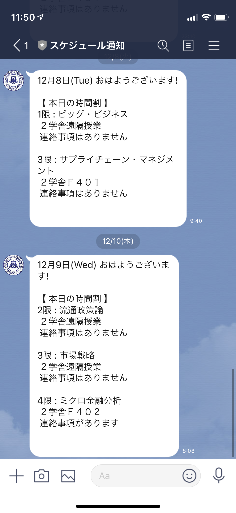

# スケジュール通知BOT
関西大学に在学している学生のための、時間割お知らせBOTになります。
下記QRコードにて公開中です。※学籍番号とパスワードが必要になります。

## QRコード

## アプリ概要
毎朝、時間割情報をお知らせしてくれるBOTになります。
・休講情報がわかる
・講義室の場所がわかる
・連絡事項がわかる

作成した背景や想いなど、より詳細な情報は下記をご覧ください。
[詳細説明](https://www.resume.id/works/2159b750fa1b163f)

## 使用技術
- Python 3.9.0
- Flask 1.1.2
- selenium 3.1
- SQLAlchemy 1.3.22
- sqlite3
- LINE Messaging API
- Heroku

## キャプチャ

## その他
現在も開発を継続しており、順次実装予定です。
